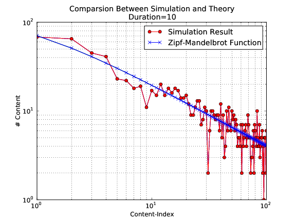
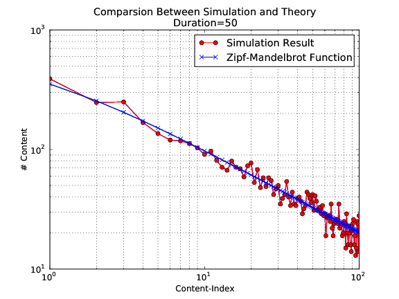
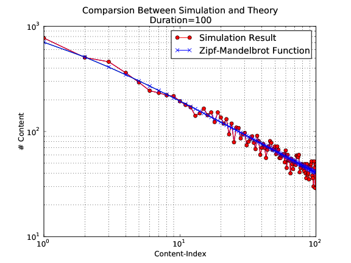
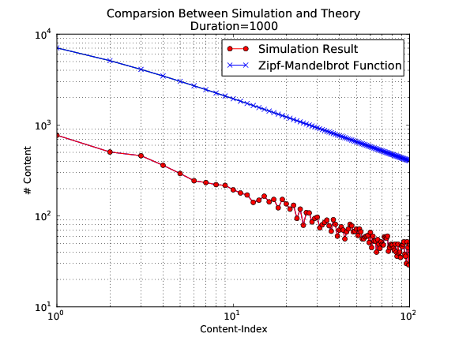

.. _applications:

ndnSIM applications
===================

ndnSIM includes a few reference applications that can be used as a base for NDN simulations.

Reference applications
++++++++++++++++++++++

ConsumerCbr
^^^^^^^^^^^

:ndnsim:`ConsumerCbr` an application that generates Interest traffic with predefined pattern (constant frequency, constant average rate with inter-Interest gap distributed uniformly at random, exponentially at random, etc.).

.. code-block:: c++

   // Create application using the app helper
   AppHelper helper("ns3::ndn::ConsumerCbr");

This applications has the following attributes:

* ``Frequency``

  .. note::
     default: ``1.0`` (1 per second)

  Either exact (for contant version) or expected (for randomized version) frequency with which Interests are generated

  .. code-block:: c++

     // Set attribute using the app helper
     helper.SetAttribute("Frequency", DoubleValue (1.0));

* ``Randomize``

  .. note::
     default: ``"none"``

  Specify whether to do randomization for inter-Interest gap or not.  The following variants are currently supported:

  - ``"none"``: no randomization

  - ``"uniform"``: uniform distribution in range (0, 1/Frequency)

  - ``"exponential"``: exponential distribution with mean 1/Frequency

  .. code-block:: c++

     // Set attribute using the app helper
     helper.SetAttribute("Randomize", StringValue("uniform"));

ConsumerZipfMandelbrot
^^^^^^^^^^^^^^^^^^^^^^

.. note::
    Author: Xiaoke Jiang

An app that requests contents (names in the requests) following Zipf-Mandelbrot distribution (number of Content frequency Distribution).
This class is a subclass of :ndnsim:`ConsumerCbr`.

.. code-block:: c++

   // Create application using the app helper
   ndn::AppHelper helper("ns3::ndn::ConsumerZipfMandelbrot");

``Frequency`` and ``Randomize`` attributes can be used in the same way as in the base :ndnsim:`ConsumerCbr` applications.

Additional attributes:

* ``NumberOfContents``

    .. note::
        default: 100

    Number of different content (sequence numbers) that will be requested by the applications

THE following pictures show basic comparison of the generated stream of Interests versus theoretical `Zipf-Mandelbrot <http://en.wikipedia.org/wiki/Zipf%E2%80%93Mandelbrot_law>`_ function (``NumberOfContents`` set to 100 and ``Frequency`` set to 100)

ConsumerBatches
^^^^^^^^^^^^^^^^^^^

:ndnsim:`ConsumerBatches` is an on-off-style application gen- erating a specified number of Interests at specified points of simulation.

.. code-block:: c++

   // Create application using the app helper
   ndn::AppHelper consumerHelper("ns3::ndn::ConsumerBatches");

This applications has the following attributes:

* ``Batches``

  .. note::
     default: Empty

  Specify exact pattern of Interest packets, specifying when and how many Interest packets should be sent.
  The following example defines that 1 Interest should be requested at time 1s, 5 Interests at time 5s, and 2 Interests at time 10s.:

  .. code-block:: c++

     // Set attribute using the app helper
     helper.SetAttribute("Batches", StringValue("1s 1 2s 5 10s 2"));

ConsumerWindow
^^^^^^^^^^^^^^^^^^

:ndnsim:`ConsumerWindow` is an application generating a variable rate Interest traffic. It implements a simple sliding-window-based Interest generation mechanism.

.. code-block:: c++

   // Create application using the app helper
   AppHelper consumerHelper("ns3::ndn::ConsumerWindow");

This applications has the following attributes:

* ``Window``

  .. note::
     default: ``1``

  Initial number of Interests that will be send out without waiting for the data (number of outstanding Interests)

* ``PayloadSize``

  .. note::
     default: ``1040``

  Expected size of the Data payload (necessary only when Size is specified)

* ``Size``

  .. note::
     default: ``-1``

  Amount of data to be requested (will stop issuing Interests after ``Size`` data is received)

  If ``Size`` is set to -1, Interests will be requested till the end of the simulation.

Producer
^^^^^^^^^^^^

:ndnsim:`Producer` a simple Interest-sink application, which replying every incoming Interest with Data packet with a specified size and name same as in Interest.

.. code-block:: c++

   // Create application using the app helper
   AppHelper consumerHelper("ns3::ndn::Producer");

.. _Custom applications:

Custom applications
+++++++++++++++++++

Applications interact with the core of the system using :ndnsim:`AppFace` realization of Face abstraction.
To simplify implementation of specific NDN application, ndnSIM provides a base :ndnsim:`App` class that takes care of creating :ndnsim:`AppFace` and registering it inside the NDN protocol stack, as well as provides default processing for incoming Interest and Data packets.

.. Base App class
.. ^^^^^^^^^^^^^^^^^^

Customer example
^^^^^^^^^^^^^^^^

The following code shows how a simple ndnSIM application can be created, and how an application can send Interests and respond with ContentObjects to incoming interests.

When this application starts it sets "interest filter" (install FIB entry) for /prefix/sub, as well as sends Interest for this prefix.
When an Interest is received, it is replied with a ContentObject with 1024-byte fake payload.

For more details refer ``examples/ndn-custom-apps/custom-app.hpp``, ``examples/ndn-custom-apps/custom-app.cpp`` and API documentation of ndnSIM and NS-3.

Header file ``examples/ndn-custom-apps/custom-app.hpp``:

.. literalinclude:: ../../examples/ndn-custom-apps/custom-app.hpp
    :language: c++
    :linenos:
    :lines: 20-28,39-

Source file ``examples/ndn-custom-apps/custom-app.cpp``:

.. literalinclude:: ../../examples/ndn-custom-apps/custom-app.cpp
    :language: c++
    :linenos:
    :lines: 20-

Example how to use custom app in a scenario (``ndn-simple-with-custom-app.cpp``):

 .. *      +------+ <-----> (CustomApp1)
 .. *      | Node |
 .. *      +------+ <-----> (CustomApp2)
 .. *

.. literalinclude:: ../../examples/ndn-custom-apps.cpp
    :language: c++
    :linenos:
    :lines: 20-27,37-

To run this scenario, use the following command::

        NS_LOG=CustomApp ./waf --run=ndn-custom-apps

Producer example (Interest hijacker)
^^^^^^^^^^^^^^^^^^^^^^^^^^^^^^^^^^^^

The following code demonstrates how to implement a basic producer application that "hijacks" all incoming Interests.

Header file ``examples/ndn-custom-apps/hijacker.hpp``:

.. literalinclude:: ../../examples/ndn-custom-apps/hijacker.hpp
    :language: c++
    :linenos:
    :lines: 20-

Source file ``examples/ndn-custom-apps/hijacker.cpp``:

.. literalinclude:: ../../examples/ndn-custom-apps/hijacker.cpp
    :language: c++
    :linenos:
    :lines: 20-

After defining this class, you can use it with :ndnsim:`ndn::AppHelper`. For example:

.. code-block:: c++

    ...
    ndn::AppHelper producerHelper("Hijacker");
    producerHelper.Install(producerNode);
    ...
