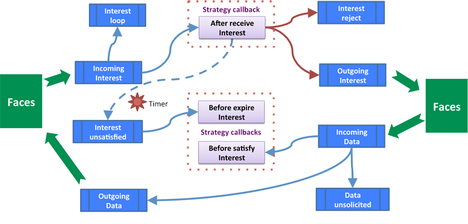

.. _forwarding strategies:

Forwarding Strategies
=====================

ndnSIM through its integration with NFD provides simple ways to experiment with the custom
Interest/Data forwarding strategies of NFD.

A new forwarding strategy can be implement completely different processing or override just
specific actions/events of the :nfd:`forwarding strategy interface <nfd::fw::Strategy>`.  NFD
offers the maximum flexibility by allowing per-namespace selection of each specific forwarding
strategy.

Please refer to :nfd:`API documentation <nfd::fw::Strategy>` of the forwarding strategy
interface, which lists all default actions/events. For a more detailed specification, you can
read `NFD Developer's Guide
<http://named-data.net/wp-content/uploads/2014/07/NFD-developer-guide.pdf>`_, section 5.

Available forwarding strategies
+++++++++++++++++++++++++++++++

+--------------------------------------------+----------------------------------------------------------------------------------------------+
| Strategy Name                              | Description                                                                                  |
+============================================+==============================================================================================+
| ``/localhost/nfd/strategy/best-route``     | :nfd:`Best Route Strategy <nfd::fw::BestRouteStrategy2>` **(default)**                       |
|                                            |                                                                                              |
|                                            | The best route strategy forwards an Interest to the                                          |
|                                            | upstream with lowest routing cost.                                                           |
+--------------------------------------------+----------------------------------------------------------------------------------------------+
+--------------------------------------------+----------------------------------------------------------------------------------------------+
| ``/localhost/nfd/strategy/ncc``            | :nfd:`NCC Strategy <nfd::fw::NccStrategy>`                                                   |
|                                            |                                                                                              |
|                                            | The NCC strategy is an reimplementation of CCNx 0.7.2                                        |
|                                            | default strategy. It has similar algorithm but is not                                        |
|                                            | guaranteed to be equivalent.                                                                 |
+--------------------------------------------+----------------------------------------------------------------------------------------------+
+--------------------------------------------+----------------------------------------------------------------------------------------------+
| ``/localhost/nfd/strategy/multicast``      |  :nfd:`Multicast Strategy <nfd::fw::MulticastStrategy>`                                      |
|                                            |                                                                                              |
|                                            |  The multicast strategy forwards every Interest to all                                       |
|                                            |  upstreams, indicated by the supplied FIB entry.                                             |
+--------------------------------------------+----------------------------------------------------------------------------------------------+
+--------------------------------------------+----------------------------------------------------------------------------------------------+
| ``/localhost/nfd/strategy/client-control`` | :nfd:`Client Control Strategy <nfd::fw::ClientControlStrategy>`                              |
|                                            |                                                                                              |
|                                            | The client control strategy allows a local consumer                                          |
|                                            | application to choose the outgoing face of each Interest.                                    |
+--------------------------------------------+----------------------------------------------------------------------------------------------+

.. note::

    ndnSIM 2.0 exactly like NFD allows different namespaces to be associated with different
    forwarding strategies.  By default, the following forwarding strategy configuration is
    defined:

    +--------------------+-----------------------------------------------+
    | Namespace          | Strategy Name                                 |
    +====================+===============================================+
    | ``/``              | ``/localhost/nfd/strategy/best-route``        |
    +--------------------+-----------------------------------------------+
    | ``/localhost``     | ``/localhost/nfd/strategy/multicast``         |
    +--------------------+-----------------------------------------------+
    | ``/localhost/nfd`` | ``/localhost/nfd/strategy/best-route``        |
    +--------------------+-----------------------------------------------+
    | ``/ndn/multicast`` | ``/localhost/nfd/strategy/multicast``         |
    +--------------------+-----------------------------------------------+

Examples:

      .. code-block:: c++

         StrategyChoiceHelper::Install(nodes, prefix,
                                       "/localhost/nfd/strategy/multicast");

.. _Writing your own custom strategy:

Writing your own custom strategy
++++++++++++++++++++++++++++++++

One of the objectives and features of ndnSIM 2.0 is that it uses NFD codebase for packet
forwarding.  Therefore, writing strategy in ndnSIM is almost exactly the same process as
outlined in `Section 5.3 of the NFD Developer's Guide
<http://named-data.net/wp-content/uploads/2014/07/NFD-developer-guide.pdf>`_.

The purpose of the strategy is to decides how to forward Interests and it is not intended to
override any processing steps in the forwarding pipelines of NFD.  If it is desired to support
a new packet type (other than Interest and Data), a new field in Interest or Data packets, or
override some actions in the pipelines (e.g., disable ContentStore lookup), it can be
accomplished by modification of the forwarding pipelines in :nfd:`nfd::Forwarder` class.

The initial step in creating a new strategy is to create a class, say ``MyStrategy`` that is
derived from :nfd:`nfd::fw::Strategy`. This subclass must at least override the triggers that are
marked pure virtual and may override other available triggers that are marked just virtual.

If the strategy needs to store information, it is needed to decide whether the information
is related to a namespace or an Interest. Information related to a namespace but not
specific to an Interest should be stored in Measurements entries; information related to an
Interest should be stored in PIT entries, PIT downstream records, or PIT upstream records.
After this decision is made, a data structure derived from StrategyInfo class needs to be
declared. In the existing implementation, such data structures are declared as nested
classes as it provides natural grouping and scope protection of the strategy-specific
entity, but it is not required to follow the same model. If timers are needed, EventId
fields needs to be added to such data structure(s).

          strategy callbacks

The final step is to implement one or more of the triggers with the desired strategy logic.
These triggers are listed below:

- :nfd:`After Receive Interest Trigger <nfd::fw::Strategy::afterReceiveInterest()>`

    When an Interest is received, passes necessary checks, and needs to be forwarded, Incoming
    Interest pipeline (Section 4.2.1) invokes this trigger with the PIT entry, incoming Interest
    packet, and FIB entry. At that time, the following conditions hold for the Interest:

    - The Interest does not violate ``/localhost`` scope.
    - The Interest is not looped.
    - The Interest cannot be satisfied by ContentStore.
    - The Interest is under a namespace managed by this strategy.

    After being triggered, the strategy should decide whether and where to forward this
    Interest. If the strategy decides to forward this Interest, it should invoke send Interest
    action at least once. If the strategy concludes that this Interest cannot be forwarded, it
    should invoke reject pending Interest action, so that the PIT entry will be deleted
    shortly.

- :nfd:`Before Satisfy Interest Trigger <nfd::fw::Strategy::beforeSatisfyInterest()>`

    This method will be triggered just before the pending Interest is being satisfied.  It may
    be useful override this method, e.g., to measure data plane performance.

- :nfd:`Before Expire Interest Trigger <nfd::fw::Strategy::beforeExpirePendingInterest()>`

    This method will be triggered just before the pending Interest is timed out.  Same as with
    the before satisfy interest trigger, this method may be useful o measure data plane
    performance.

Example
^^^^^^^

The following code implements a random load balancing forwarding strategy. This strategy
was created by Steve DiBenedetto and was found in one of his `GitHub repository
<https://github.com/dibenede/ndn-tutorial-gec21>`_.

.. literalinclude:: ../../examples/ndn-load-balancer/random-load-balancer-strategy.hpp
   :language: c++
   :linenos:
   :lines: 26-

.. literalinclude:: ../../examples/ndn-load-balancer/random-load-balancer-strategy.cpp
   :language: c++
   :linenos:
   :lines: 26-

This forwarding strategy can be enabled for a specific name prefix when developing the
simulation scenario as follows:

      .. code-block:: c++

         #include "random-load-balancer-strategy.hpp"

         ...

         StrategyChoiceHelper::Install<nfd::fw::RandomLoadBalancerStrategy>(nodes, prefix);

Example of using custom strategy
^^^^^^^^^^^^^^^^^^^^^^^^^^^^^^^^

Please refer to :ref:`6-node topology with custom NFD forwarding strategy` .
