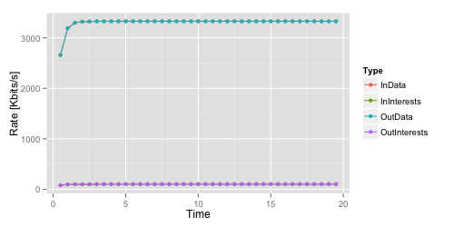
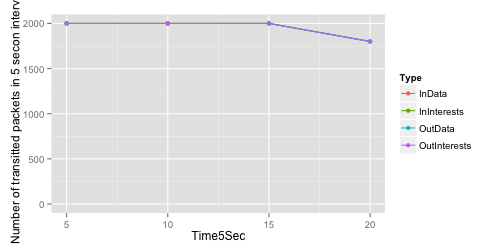

Obtaining metrics
=================

To obtain simulation results, you would need to connect to one or more `trace sources <doxygen/group___trace_source_list.html>`_ provided by ndnSIM classes.

It is also possible to use existing trace helpers, which collects and aggregates requested statistical information in text files.

.. _trace classes:

Packet-level trace helpers
--------------------------

- :ndnsim:`ndn::L3AggregateTracer`

    Tracing the aggregate number of Interests/Data packets forwarded by an NDN node

    The following example enables tracing on all simulation nodes:

    .. code-block:: c++

        // necessary includes
	#include <ns3/ndnSIM/utils/tracers/ndn-l3-aggregate-tracer.h>

	...

        // the following should be put just before calling Simulator::Run in the scenario

        boost::tuple< boost::shared_ptr<std::ostream>, std::list<Ptr<ndn::L3AggregateTracer> > >
          aggTracers = ndn::L3AggregateTracer::InstallAll ("aggregate-trace.txt", Seconds (1.0));

        Simulator::Run ();

        ...

- :ndnsim:`ndn::L3RateTracer`

    Tracing the rate in bytes and in number of packets of Interest/Data packets forwarded by an NDN node

    The following example enables tracing on all simulation nodes:

    .. code-block:: c++

        // necessary includes
	#include <ns3/ndnSIM/utils/tracers/ndn-l3-rate-tracer.h>

	...

        // the following should be put just before calling Simulator::Run in the scenario

        boost::tuple< boost::shared_ptr<std::ostream>, std::list<Ptr<ndn::L3RateTracer> > >
          rateTracers = ndn::L3RateTracer::InstallAll ("rate-trace.txt", Seconds (1.0));

        Simulator::Run ();

        ...

.. note::

    A number of other tracers are available in ``plugins/tracers-broken`` folder, but they do not yet work with the current code.
    Eventually, we will port most of them to the current code, but it is not our main priority at the moment and would really appreciate help with writing new tracers and porting the old ones.

.. _packet trace helper example:

Example of packet-level trace helpers
+++++++++++++++++++++++++++++++++++++

This example (``ndn-tree-tracers.cc``) demonstrates basic usage of :ref:`trace classes`.

In this scenario we will use a tree-like topology, where consumers are installed on leaf nodes and producer is in the root of the tree:

.. aafig::
    :aspect: 60
    :scale: 120

     /--------\    /--------\    /--------\    /--------\
     |"leaf-1"|    |"leaf-2"|    |"leaf-3"|    |"leaf-4"|
     \--------/    \--------/    \--------/    \--------/
           ^          ^                ^           ^
           |          |                |           |
      	    \        /                  \         /
             \      /  			 \  	 /    10Mbps / 1ms
              \    /  			  \ 	/
               |  |  			   |   |
      	       v  v                        v   v
	    /-------\                    /-------\
	    |"rtr-1"|                    |"rtr-2"|
            \-------/                    \-------/
                  ^                        ^
		  |	 		   |
		   \			  /  10 Mpbs / 1ms
		    +--------\  /--------+
			     |  |
                             v  v
			  /--------\
			  | "root" |
                          \--------/

The corresponding topology file (``topo-tree.txt``):

.. literalinclude:: ../../examples/topologies/topo-tree.txt
    :language: bash
    :linenos:
    :lines: 1-2,27-

Example simulation (``ndn-tree-tracers.cc``) scenario that utilizes trace helpers:

.. literalinclude:: ../../examples/ndn-tree-tracers.cc
    :language: c++
    :linenos:
    :lines: 21-34,67-
    :emphasize-lines: 7-11,63-67

To run this scenario, use the following command::

        ./waf --run=ndn-tree-tracers

The successful run will create ``rate-trace.txt`` and ``aggregate-trace.txt`` files in the current directly, which can be analyzed manually or used as input to some graph/stats packages.

For example, the following `R script <http://www.r-project.org/>`_ will build a number of nice graphs:

.. literalinclude:: ../../examples/graphs/rate-graph.R
    :language: r
    :linenos:

For more information about R and ggplot2, please refer to `R language manual <http://cran.r-project.org/manuals.html>`_, `ggplot2 module manual <http://docs.ggplot2.org/current/>`_.

.. _cs trace helper:

Content store trace helper
--------------------------

- :ndnsim:`ndn::CsTracer`

    With the use of :ndnsim:`ndn::CsTracer` it is possible to obtain statistics of cache hits/cache misses on simulation nodes.

    The following code enables content store tracing:

    .. code-block:: c++

        // necessary includes
        #include <ns3/ndnSIM/utils/tracers/ndn-cs-tracer.h>

	...

        // Select implementation of content store. By default, the following is applied:
        // ndnHelper.SetContentStore ("ns3::ndn::cs::Stats::Lru", "MaxSize", "100");

        // the following should be put just before calling Simulator::Run in the scenario

        boost::tuple< boost::shared_ptr<std::ostream>, std::list<Ptr<ndn::CsTracer> > >
           aggTracers = ndn::CsTracer::InstallAll ("cs-trace.txt", Seconds (1));

        Simulator::Run ();

        ...

.. - Tracing lifetime of content store entries

..     Evaluate lifetime of the content store entries can be accomplished using modified version of the content stores.
..     In particular,

.. _cs trace helper example:

Example of content store trace helper
+++++++++++++++++++++++++++++++++++++

This example (``ndn-tree-cs-tracers.cc``) demonstrates basic usage of content store tracer.

In this scenario we will use the same tree-like topology as in :ref:`previous example <packet trace helper example>`, where consumers are installed on leaf nodes and producer is in the root of the tree.
The main difference is that each client request data from the same namespace: /root/1, /root/2, ...  Another small difference is that in this scenario we start our application not at the same time, but 10 ms apart.

Example simulation (``ndn-tree-cs-tracers.cc``) scenario that utilizes trace helpers:

.. literalinclude:: ../../examples/ndn-tree-cs-tracers.cc
    :language: c++
    :linenos:
    :lines: 21-31,64-
    :emphasize-lines: 7-11,25,43,45,62-63

To run this scenario, use the following command::

        ./waf --run=ndn-tree-cs-tracers

The successful run will create ``cs-trace.txt``, which similarly to trace file from the :ref:`tracing example <packet trace helper example>` can be analyzed manually or used as input to some graph/stats packages.

Application-level trace helper
------------------------------

- :ndnsim:`ndn::AppDelayTracer`

    With the use of :ndnsim:`ndn::AppDelayTracer` it is possible to obtain data about for delays between issuing Interest and receiving corresponding Data packet.

    The following code enables application-level Interest-Data delay tracing:

    .. code-block:: c++

        // necessary includes
        #include <ns3/ndnSIM/utils/tracers/ndn-app-delay-tracer.h>

	...

        // the following should be put just before calling Simulator::Run in the scenario

        boost::tuple< boost::shared_ptr<std::ostream>, std::list<Ptr<ndn::AppDelayTracer> > >
           tracers = ndn::AppDelayTracer::InstallAll ("app-delays-trace.txt");

        Simulator::Run ();

        ...

    Output file format is tab-separated values, with first row specifying names of the columns.  Refer to the following table for the description of the columns:

    +-----------------+---------------------------------------------------------------------+
    | Column          | Description                                                         |
    +=================+=====================================================================+
    | ``Time``        | simulation time when SeqNo was receivied                            |
    +-----------------+---------------------------------------------------------------------+
    | ``Node``        | node id, global unique                                              |
    +-----------------+---------------------------------------------------------------------+
    | ``AppId``       | app id, local unique on the node, not global                        |
    +-----------------+---------------------------------------------------------------------+
    | ``SeqNo``       | seq number of the Interest-Data                                     |
    +-----------------+---------------------------------------------------------------------+
    | ``Type``        | Type of delay:                                                      |
    |                 |                                                                     |
    |                 | - ``LastDelay`` means that ``DelayS`` and ``DelayUS`` represent     |
    |                 |   delay between last Interest sent and Data packet received         |
    |                 | - ``FullDelay`` means that ``DelayS`` and ``DelayUS`` represent     |
    |                 |   delay between first Interest sent and Data packet received        |
    |                 |   (i.e., includes time of Interest retransmissions)                 |
    +-----------------+---------------------------------------------------------------------+
    | ``DelayS``      | delay value, specified in seconds                                   |
    +-----------------+---------------------------------------------------------------------+
    | ``DelayUS``     | delay value, specified in microseconds (10^-6)                      |
    +-----------------+---------------------------------------------------------------------+
    | ``RetxCount``   | number of Interest retransmissions (for LastDelay always equal to 1)|
    +-----------------+---------------------------------------------------------------------+
    | ``HopCount``    | combined number of number of hops for Interest and Data packet.     |
    |                 | Note that HopCount is increased anytime somebody calls Send method  |
    |                 | on a face, including delivery of Interest/Data to application via   |
    |                 | an AppFace (but not from application to ndn::L3Protocol!).          |
    |                 |                                                                     |
    |                 | One consequence is that Interests satisfied by an app will have     |
    |                 | even hop count (min hop count = 2), and Interests satisfied from    |
    |                 | caches will have off hop count (min hop count = 1)                  |
    +-----------------+---------------------------------------------------------------------+

.. _app delay trace helper example:

Example of application-level trace helper
+++++++++++++++++++++++++++++++++++++++++

This example (``ndn-tree-app-delay-tracer.cc``) demonstrates basic usage of application-level Interest-Data delay tracer.

In this scenario we will use the same tree-like topology as in :ref:`packet trace helper example <packet trace helper example>`, where consumers are installed on leaf nodes and producer is in the root of the tree and clients request data from the same namespace: /root/1, /root/2, ...

Example simulation (``ndn-tree-app-delay-tracer.cc``) scenario that utilizes trace helpers:

.. literalinclude:: ../../examples/ndn-tree-app-delay-tracer.cc
    :language: c++
    :linenos:
    :lines: 21-31,64-
    :emphasize-lines: 7-8,61-62

To run this scenario, use the following command::

        ./waf --run=ndn-tree-app-delay-tracer

The successful run will create ``app-delays-trace.txt``, which similarly to trace file from the :ref:`packet trace helper example <packet trace helper example>` can be analyzed manually or used as input to some graph/stats packages.

