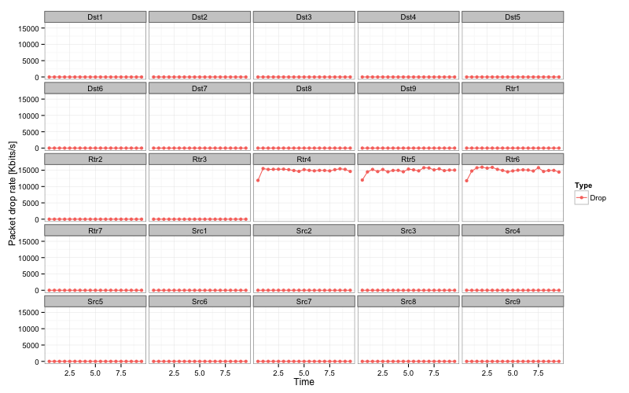

Obtaining metrics
=================

To obtain simulation results, you would need to connect to one or more `trace sources <doxygen/group___trace_source_list.html>`_ provided by ndnSIM classes.

It is also possible to use existing trace helpers, which collects and aggregates requested statistical information in text files.

.. _trace classes:

Packet-level trace helpers
--------------------------

- :ndnsim:`ndn::L3RateTracer`

    Tracing the rate in bytes and in number of packets of Interest/Data packets forwarded by an NDN node

    The following example enables tracing on all simulation nodes:

    .. code-block:: c++

        // the following should be put just before calling Simulator::Run in the scenario

        L3RateTracer::InstallAll("rate-trace.txt", Seconds(1.0));

        Simulator::Run();

        ...

    Output file format is tab-separated values, with first row specifying names of the columns.  Refer to the following table for the description of the columns:

    +------------------+---------------------------------------------------------------------+
    | Column           | Description                                                         |
    +==================+=====================================================================+
    | ``Time``         | simulation time                                                     |
    +------------------+---------------------------------------------------------------------+
    | ``Node``         | node id, globally unique                                            |
    +------------------+---------------------------------------------------------------------+
    | ``FaceId``       | interface ID (-1 for combined metric)                               |
    +------------------+---------------------------------------------------------------------+
    | ``Type``         | Type of measurements:                                               |
    |                  |                                                                     |
    |                  | - ``InInterests``  measurements of incoming Interests               |
    |                  | - ``OutInterests``  measurements of outgoing Interests              |
    |                  | - ``InData``  measurements of incoming Data                         |
    |                  | - ``OutData``  measurements of outgoing Data                        |
    |                  | - ``InNacks``  measurements of outgoing NACKs                       |
    |                  | - ``OutNacks``  measurements of outgoing NACKs                      |
    |                  | - ``SatisfiedInterests`` measurements of satisfied Interests        |
    |                  |   (totals for all faces)                                            |
    |                  | - ``TimedOutInterests`` measurements of timed out Interests         |
    |                  |   (totals for all faces)                                            |
    |                  | - ``InSatisfiedInterests`` measurements of incoming satisfied       |
    |                  |   Interests (per incoming face)                                     |
    |                  | - ``InTimedOutInterests`` measurements of incoming timed out        |
    |                  |   Interests (per incoming face)                                     |
    |                  | - ``OutSatisfiedInterests`` measurements of outgoing satisfied      |
    |                  |   Interests (per outgoing face)                                     |
    |                  | - ``OutTimedOutInterests`` measurements of outgoing satisfied       |
    |                  |   Interests (per outgoing face)                                     |
    +------------------+---------------------------------------------------------------------+
    | ``Packets``      | estimated rate (EWMA average) of packets within the last averaging  |
    |                  | period (number of packets/s).                                       |
    +------------------+---------------------------------------------------------------------+
    | ``Kilobytes``    | estimated rate (EWMA average) within last averaging                 |
    |                  | period (kilobytes/s)                                                |
    +------------------+---------------------------------------------------------------------+
    | ``PacketsRaw``   | absolute number of packets within last averaging period             |
    |                  | (number of packets).                                                |
    +------------------+---------------------------------------------------------------------+
    | ``KilobytesRaw`` | absolute number of kilobytes transferred within the last averaging  |
    |                  | period  (number of packets).                                        |
    +------------------+---------------------------------------------------------------------+

- :ndnsim:`L2Tracer`

    This tracer is similar in spirit to :ndnsim:`ndn::L3RateTracer`, but it currently traces only packet drop on layer 2 (e.g.,
    due to transmission queue overflow).

    The following example enables tracing on all simulation nodes:

    .. code-block:: c++

        // the following should be put just before calling Simulator::Run in the scenario

        L2RateTracer::InstallAll("drop-trace.txt", Seconds(0.5));

        Simulator::Run();

        ...

    Output file format is tab-separated values, with first row specifying names of the columns.  Refer to the following table for the description of the columns:

    +------------------+---------------------------------------------------------------------+
    | Column           | Description                                                         |
    +==================+=====================================================================+
    | ``Time``         | simulation time                                                     |
    +------------------+---------------------------------------------------------------------+
    | ``Node``         | node id, globally unique                                            |
    +------------------+---------------------------------------------------------------------+
    | ``Interface``    | interface name (currently only "combined")                          |
    +------------------+---------------------------------------------------------------------+
    | ``Type``         | Type of measurements:                                               |
    |                  |                                                                     |
    |                  | - ``Drop``  measurements of dropped packets                         |
    +------------------+---------------------------------------------------------------------+
    | ``Packets``      | estimated rate (EWMA average) of packets within the last averaging  |
    |                  | period (number of packets/s).                                       |
    +------------------+---------------------------------------------------------------------+
    | ``Kilobytes``    | estimated rate (EWMA average) within last averaging                 |
    |                  | period (kilobytes/s)                                                |
    +------------------+---------------------------------------------------------------------+
    | ``PacketsRaw``   | absolute number of packets within last averaging period             |
    |                  | (number of packets).                                                |
    +------------------+---------------------------------------------------------------------+
    | ``KilobytesRaw`` | absolute number of kilobytes transferred within the last averaging  |
    |                  | period  (number of packets).                                        |
    +------------------+---------------------------------------------------------------------+

.. note::

    A number of other tracers are available in ``plugins/tracers-broken`` folder, but they do not yet work with the current code.
    Eventually, we will port most of them to the current code, but it is not our main priority at the moment and would really appreciate help with writing new tracers and porting the old ones.

.. _packet trace helper example:

Example of packet-level trace helpers
+++++++++++++++++++++++++++++++++++++

This example (``ndn-tree-tracers.cpp``) demonstrates basic usage of :ref:`trace classes`.

In this scenario we will use a tree-like topology, where consumers are installed on leaf nodes and producer is in the root of the tree:

.. sidebar:: Topology

    .. aafig::
        :aspect: 60
        :scale: 100

         /--------\    /--------\    /--------\    /--------\
         |"leaf-1"|    |"leaf-2"|    |"leaf-3"|    |"leaf-4"|
         \--------/    \--------/    \--------/    \--------/
               ^          ^                ^           ^
               |          |                |           |
                \        /                  \         /
                 \      /                    \       /    10Mbps / 1ms
                  \    /                      \     /
                   |  |                        |   |
                   v  v                        v   v
                /-------\                    /-------\
                |"rtr-1"|                    |"rtr-2"|
                \-------/                    \-------/
                      ^                        ^
                      |                        |
                       \                      /  10 Mpbs / 1ms
                        +--------\  /--------+
                                 |  |
                                 v  v
                              /--------\
                              | "root" |
                              \--------/

The corresponding topology file (``topo-tree.txt``):

.. literalinclude:: ../../examples/topologies/topo-tree.txt
    :language: bash
    :linenos:
    :lines: 1-2,27-

Example simulation (``ndn-tree-tracers.cpp``) scenario that utilizes trace helpers:

.. literalinclude:: ../../examples/ndn-tree-tracers.cpp
    :language: c++
    :linenos:
    :lines: 20-27,60-
    :emphasize-lines: 58

To run this scenario, use the following command::

        ./waf --run=ndn-tree-tracers

The successful run will create ``rate-trace.txt`` files in the current directly, which can be analyzed manually or used as input to some graph/stats packages.

.. sidebar:: Graph build using the `R script <http://www.r-project.org/>`_

    .. image:: _static/root-rates.png
        :alt: Interest/Data packet rates at the root node

.. literalinclude:: ../../examples/graphs/rate-graph.R
    :language: r
    :linenos:

For more information about R and ggplot2, please refer to `R language manual <http://cran.r-project.org/manuals.html>`_ and `ggplot2 module manual <http://docs.ggplot2.org/current/>`_.

    ::

        Rscript src/ndnSIM/examples/graphs/rate-graph.R

.. _Example of packet drop tracer (L2Tracer):

Example of packet drop tracer (L2Tracer)
----------------------------------------

.. sidebar:: Topology

    .. image:: _static/topo-tree-25-node.png
        :alt: 25-node tree topology
        :width: 550px

This example (``ndn-tree-with-l2tracer.cpp``) demonstrates basic usage of :ref:`trace classes`.

The corresponding topology file (``topo-tree-25-node.txt``):

.. literalinclude:: ../../examples/topologies/topo-tree-25-node.txt
    :language: bash
    :linenos:
    :lines: 2-

Example simulation (``ndn-tree-with-l2tracer.cpp``) scenario that utilizes trace helpers:

.. literalinclude:: ../../examples/ndn-tree-with-l2tracer.cpp
    :language: c++
    :linenos:
    :lines: 20-
    :emphasize-lines: 16,134

To run this scenario, use the following command::

        ./waf --run=ndn-tree-with-l2tracer

The successful run will create ``drop-trace.txt`` file in the current directly, which can be analyzed manually or used as input to some graph/stats packages.

For example, the following `R script <http://www.r-project.org/>`_ will build a number of nice graphs:

.. literalinclude:: ../../examples/graphs/drop-graph.R
    :language: r
    :linenos:

Run R script::

    Rscript src/ndnSIM/examples/graphs/drop-graph.R

.. _cs trace helper:

Content store trace helper
--------------------------

NOTE: This tracer works ONLY when the OldContentStore structure is used!

- :ndnsim:`ndn::CsTracer`

    With the use of :ndnsim:`ndn::CsTracer` it is possible to obtain statistics of cache hits/cache misses on simulation nodes.

    The following code enables content store tracing:

    .. code-block:: c++

        // the following should be put just before calling Simulator::Run in the scenario

        CsTracer::InstallAll("cs-trace.txt", Seconds(1));

        Simulator::Run();

        ...

    Output file format is tab-separated values, with first row specifying names of the columns.  Refer to the following table for the description of the columns:

    +------------------+----------------------------------------------------------------------+
    | Column           | Description                                                          |
    +==================+======================================================================+
    | ``Time``         | simulation time                                                      |
    +------------------+----------------------------------------------------------------------+
    | ``Node``         | node id, globally unique                                             |
    +------------------+----------------------------------------------------------------------+
    | ``Type``         | Type of counter for the time period.  Possible values are:           |
    |                  |                                                                      |
    |                  | - ``CacheHits``: the ``Packets`` column specifies the number of      |
    |                  |   Interests that were satisfied from the cache                       |
    |                  | - ``CacheMisses``: the ``Packets`` column specifies the number of    |
    |                  |   Interests that were not satisfied from the cache                   |
    +------------------+----------------------------------------------------------------------+
    | ``Packets``      | The number of packets for the time period, meaning depends on        |
    |                  | ``Type`` column                                                      |
    +------------------+----------------------------------------------------------------------+

.. - Tracing lifetime of content store entries

..     Evaluate lifetime of the content store entries can be accomplished using modified version of the content stores.
..     In particular,

.. _cs trace helper example:

Example of content store trace helper
+++++++++++++++++++++++++++++++++++++

This example (``ndn-tree-cs-tracers.cpp``) demonstrates basic usage of content store tracer.

In this scenario we will use the same tree-like topology as in :ref:`previous example <packet trace helper example>`, where consumers are installed on leaf nodes and producer is in the root of the tree.
The main difference is that each client request data from the same namespace: /root/1, /root/2, ...  Another small difference is that in this scenario we start our application not at the same time, but 10 ms apart.

Example simulation (``ndn-tree-cs-tracers.cpp``) scenario that utilizes trace helpers:

.. literalinclude:: ../../examples/ndn-tree-cs-tracers.cpp
    :language: c++
    :linenos:
    :lines: 20-27,60-
    :emphasize-lines: 61

To run this scenario, use the following command::

        ./waf --run=ndn-tree-cs-tracers

The successful run will create ``cs-trace.txt``, which similarly to trace file from the :ref:`tracing example <packet trace helper example>` can be analyzed manually or used as input to some graph/stats packages.

Application-level trace helper
------------------------------

- :ndnsim:`ndn::AppDelayTracer`

    With the use of :ndnsim:`ndn::AppDelayTracer` it is possible to obtain data about for delays between issuing Interest and receiving corresponding Data packet.

    The following code enables application-level Interest-Data delay tracing:

    .. code-block:: c++

        // the following should be put just before calling Simulator::Run in the scenario

        AppDelayTracer::InstallAll("app-delays-trace.txt");

        Simulator::Run();

        ...

    Output file format is tab-separated values, with first row specifying names of the columns.  Refer to the following table for the description of the columns:

    +-----------------+---------------------------------------------------------------------+
    | Column          | Description                                                         |
    +=================+=====================================================================+
    | ``Time``        | simulation time when SeqNo was receivied                            |
    +-----------------+---------------------------------------------------------------------+
    | ``Node``        | node id, global unique                                              |
    +-----------------+---------------------------------------------------------------------+
    | ``AppId``       | app id, local unique on the node, not global                        |
    +-----------------+---------------------------------------------------------------------+
    | ``SeqNo``       | seq number of the Interest-Data                                     |
    +-----------------+---------------------------------------------------------------------+
    | ``Type``        | Type of delay:                                                      |
    |                 |                                                                     |
    |                 | - ``LastDelay`` means that ``DelayS`` and ``DelayUS`` represent     |
    |                 |   delay between last Interest sent and Data packet received         |
    |                 | - ``FullDelay`` means that ``DelayS`` and ``DelayUS`` represent     |
    |                 |   delay between first Interest sent and Data packet received        |
    |                 |   (i.e., includes time of Interest retransmissions)                 |
    +-----------------+---------------------------------------------------------------------+
    | ``DelayS``      | delay value, specified in seconds                                   |
    +-----------------+---------------------------------------------------------------------+
    | ``DelayUS``     | delay value, specified in microseconds (10^-6)                      |
    +-----------------+---------------------------------------------------------------------+
    | ``RetxCount``   | number of Interest retransmissions (for LastDelay always equal to 1)|
    +-----------------+---------------------------------------------------------------------+
    | ``HopCount``    | the number of network hops that the retrieved Data packet traveled  |
    |                 | on the way back from producer application or cache.                 |
    |                 |                                                                     |
    |                 | Note that the semantics of the ``HopCount`` field have changed      |
    |                 | compared to ndnSIM 1.0.                                             |
    +-----------------+---------------------------------------------------------------------+

.. _app delay trace helper example:

Example of application-level trace helper
+++++++++++++++++++++++++++++++++++++++++

This example (``ndn-tree-app-delay-tracer.cpp``) demonstrates basic usage of application-level Interest-Data delay tracer.

In this scenario we will use the same tree-like topology as in :ref:`packet trace helper example <packet trace helper example>`, where consumers are installed on leaf nodes and producer is in the root of the tree and clients request data from the same namespace: /root/1, /root/2, ...

Example simulation (``ndn-tree-app-delay-tracer.cpp``) scenario that utilizes trace helpers:

.. literalinclude:: ../../examples/ndn-tree-app-delay-tracer.cpp
    :language: c++
    :linenos:
    :lines: 20-27,60-
    :emphasize-lines: 60

To run this scenario, use the following command::

        ./waf --run=ndn-tree-app-delay-tracer

The successful run will create ``app-delays-trace.txt``, which similarly to trace file from the
:ref:`packet trace helper example <packet trace helper example>` can be analyzed manually or used as
input to some graph/stats packages.
